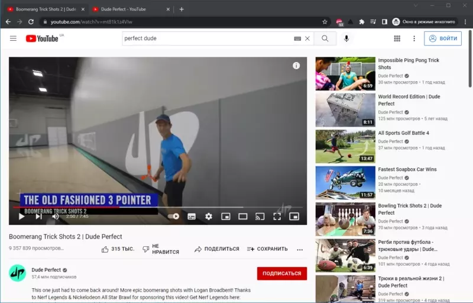

# youtube-extra-button-extension
 
## Description

Simple extension that allows to open **YouTube** video in `picture in picture` mode. 

**YouTube** doesn't have this feature by default so I decided to make one.

Official generic version made by **Google** that works on each website — [Link](https://chrome.google.com/webstore/detail/picture-in-picture-extens/hkgfoiooedgoejojocmhlaklaeopbecg)

## Showcase
<table>
  <tr>
    <td>
      
    </td>
  </tr>
</table>
